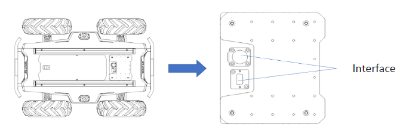
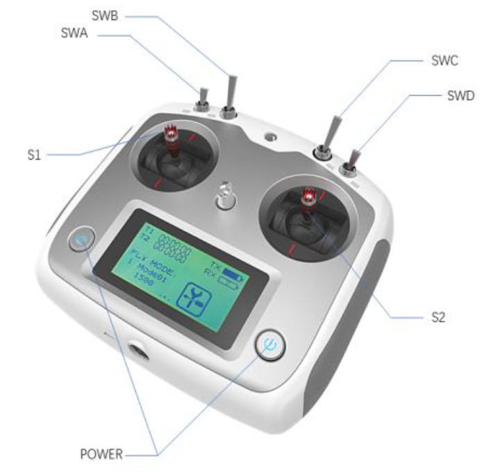

Overview
--------

.. figure:: _static/front_view_v2.png
   :width: 90%
   :align: center
   :figclass: align-centered
   :alt: front view

.. figure:: _static/rear_view_v2.png
   :width: 100%
   :align: center
   :figclass: align-centered
   :alt: rear view

충돌 방지 펜스는 로봇 주위에 설치되어 충돌시 차체의 손상을 줄입니다.

조명은 로봇의 전면과 후면에 설치되어 있습니다. 
전면에는 백색 조명이 설치되어 있고, 후면에는 적색 조명이 설치되어 있습니다.

로봇 양쪽에 비상 정지 스위치가 설치되어 있습니다.
로봇이 비정상적으로 동작 할 때 로봇의 전원을 즉시 차단할 수 있습니다.

DC 전원 및 통신 인터페이스를 위한 방수 커넥터는 로봇의 상단과 후면에 있습니다.
로봇과 외부 구성 요소를 유연하게 연결할 수 있고, 외부 요인으로부터 로봇 내부를 보호할 수 있습니다.
로봇의 상단에는 알루미늄 프로파일이 설치되어 있어, 추가 디바이스들을 쉽게 설치할 수 있습니다.

|

Indication
++++++++++

사용자는 전압 디스플레이, 신호음 및 조명을 통해서 로봇의 상태를 확인할 수 있습니다.

**Voltage:**  
배터리의 현재 전압은 로봇 후면에 있는 인터페이스에서 확인할 수 있습니다. 전압은 1V 단위로 표시됩니다.

**Battery:**
배터리 전압이 22.5V보다 낮으면 경고음이 울립니다. 
배터리 전압이 22V보다 낮아지면 로봇은 전원 공급을 차단하여 배터리 손상을 방지합니다. 

**Power on:**
로봇 전면과 후면의 조명이 켜집니다. 

|

Electrical Interface
++++++++++++++++++++

Scout은 4핀 항공 커넥터 2개와 DB9(RS232) 커넥터 1개를 제공합니다.
로봇의 상단과 후면에 항공 커넥터가 있으며, 전원 단자와 CAN 통신 단자로 구성되어 있습니다.

.. warning::

   배터리의 전압이 일정 전압 아래로 떨어지면 전원 공급이 차단됩니다.

Top Electrical Interface
''''''''''''''''''''''''

.. figure:: _static/top_aviation_connector.png
   :width: 25%
   :align: center
   :figclass: align-centered
   :alt: top aviation connector

+---------+----------+-------------------------+-------------------------------+
| Pin No. | Pin Type | Function and Definition | Remarks                       |
+=========+==========+=========================+===============================+
| 1       | Power    | VCC                     | Power positive, 23-29.2V, 10A |
+---------+----------+-------------------------+-------------------------------+
| 2       | Power    | GND                     | Power negative                |
+---------+----------+-------------------------+-------------------------------+
| 3       | CAN      | CAN_H                   | CAN bus high                  |
+---------+----------+-------------------------+-------------------------------+
| 4       | CAN      | CAN_L                   | CAN bus low                   |
+---------+----------+-------------------------+-------------------------------+

.. figure:: _static/top_db9_connector.png
   :width: 25%
   :align: center
   :figclass: align-centered
   :alt: top db9 connector

+---------+------------+
| Pin No. | Definition |
+=========+============+
| 2       | RS232-RX   |
+---------+------------+
| 3       | RS232-TX   |
+---------+------------+
| 5       | GND        |
+---------+------------+

Rear Electrical Interface
'''''''''''''''''''''''''

.. figure:: _static/rear_electrical_interface.png
   :width: 100%
   :align: center
   :figclass: align-centered
   :alt: rear electrical interface

+-----+----------------------------------------+
| No. | Definition                             |
+=====+========================================+
| Q1  | Main electrical switch                 |
+-----+----------------------------------------+
| Q2  | Charging interface                     |
+-----+----------------------------------------+
| Q3  | Power supply switch of drive system    |
+-----+----------------------------------------+
| Q4  | DB9 serial port                        |
+-----+----------------------------------------+
| Q5  | Interface for CAN and 24V power supply |
+-----+----------------------------------------+
| Q6  | Display of battery voltage             |
+-----+----------------------------------------+

.. figure:: _static/rear_aviation_connector.png
   :width: 25%
   :align: center
   :figclass: align-centered
   :alt: rear aviation connector

+---------+----------+-------------------------+-------------------------------+
| Pin No. | Pin Type | Function and Definition | Remarks                       |
+=========+==========+=========================+===============================+
| 1       | Power    | VCC                     | Power positive, 23-29.2V, 5A  |
+---------+----------+-------------------------+-------------------------------+
| 2       | Power    | GND                     | Power negative                |
+---------+----------+-------------------------+-------------------------------+
| 3       | CAN      | CAN_H                   | CAN bus high                  |
+---------+----------+-------------------------+-------------------------------+
| 4       | CAN      | CAN_L                   | CAN bus low                   |
+---------+----------+-------------------------+-------------------------------+

|

Remote Control
++++++++++++++

RC 조종기를 이용하여 로봇을 수동으로 조작할 수 있습니다. 
모든 스위치를 중립 상태(상단으로 위치)로 두고, 두 개의 전원 버튼을 누르면 조종기를 켤 수 있습니다.
조종기에는 2개의 스로틀이 있습니다. S1과 S2를 이용하여 각각 선속도과 각속도 명령을 보낼 수 있습니다.
SWB 스위치를 중간 위치에 있으면 원격 제어 모드가 활성화되고, 하단 위치에 있으면 명령 모드가
활성화됩니다.
SWC 스위치를 이용하면 조명 제어 모드(NC, NO, BL)를 전환할 수 있습니다.

|

Light Control
+++++++++++++

로봇의 전면과 후면에 조명이 설치되어 있으며, 제어 인터페이스는 사용자에게 개방되어 있습니다.

**NC:** 조명이 항시 꺼집니다.

**NO:** 조명이 항시 켜집니다.

**BL:** 조명이 점차적으로 켜졌다가 꺼졌다가를 반복합니다.

**CUSTOM:** 지정한 밝기로 조명이 켜집니다.

|

Coordinate System
++++++++++++++++++

.. figure:: _static/coordinate_v2.png
   :width: 90%
   :align: center
   :figclass: align-centered
   :alt: coordinate

Scout의 기준 좌표계는 위와 같습니다. 로봇의 차체는 좌표계의 X축과 평행합니다.

|

Charging
++++++++

사용자에게 로봇과 함께 10A 배터리 충전기를 제공합니다.
충전 절차는 아래와 같습니다.

1. 로봇의 전원이 꺼져 있는지 확인하십시오.
2. 로봇 후면의 충전 인터페이스와 배터리 충전기의 플러그를 연결하십시오.
3. 배터리 충전기의 전원을 켜십시오.

.. note::

   현재 배터리의 전압이 22V인 경우, 완전히 재충전하는데 약 3~5시간이 필요합니다.
   완전 충전된 배터리의 전압은 26.5V 입니다.

|

Development
+++++++++++

Scout은 사용자가 개발할 수 있도록 **CAN, RS232** 통신 인터페이스를 제공합니다.
통신 인터페이스를 이용하여 사용자가 직접 로봇을 제어할 수 있습니다.

|

Dimensions
+++++++++++

.. figure:: _static/dimensions_v2.png
   :width: 90%
   :align: center
   :figclass: align-centered
   :alt: dimensions

|